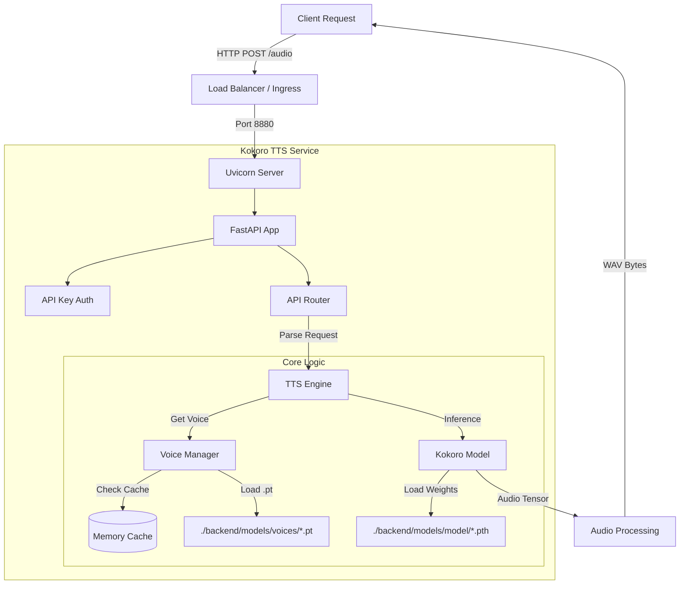

# Kokoro TTS Service

<div align="center">


**A high-performance, containerized Text-to-Speech API powered by the Kokoro-82M model.**

[Overview](#overview) • [Features](#features) • [Architecture](#architecture) • [Getting Started](#getting-started) • [API Reference](#api-reference) • [Configuration](#configuration)

</div>

---

## Overview

The **Kokoro TTS Service** is a production-ready API designed to provide high-quality, real-time text-to-speech synthesis. Built on top of **FastAPI** and the **Kokoro-82M** model, it offers a robust solution for generating audio in multiple languages and voices. 

This service is engineered for efficiency, featuring lazy model loading, thread-safe voice management with automatic memory cleanup (TTL), and a fully optimized Docker environment.

## Features

- 🚀 **High-Performance Inference:** Powered by Kokoro-82M and PyTorch for realistic speech synthesis.
- 🌐 **Multi-Language Support:** Generate audio in American English, British English, Japanese, and more.
- 🎙️ **Dynamic Voice Management:** Lazy loading of voice embeddings with configurable Time-To-Live (TTL) caching to optimize memory.
- 🐳 **Containerized:** Production-ready multi-stage Docker build based on Debian Bookworm Slim.
- 🔒 **Secure:** API Key authentication and strict input validation.
- 📊 **Observability:** Health checks, memory monitoring, and structured logging.
- ⚡ **Async Architecture:** Non-blocking request handling with background thread pools for heavy inference tasks.

## Architecture

The service follows a layered architecture to separate concerns between the API interface, business logic, and the underlying ML model.



## Getting Started

### Prerequisites

- **Python:** 3.11+
- **Docker:** (Optional, for containerized deployment)
- **System Dependencies:** `espeak-ng`, `cmake`, `build-essential` (Handled automatically in Docker)

### 📥 1. Installation (Local)

1.  **Clone the repository:**
    ```bash
    git clone <repository-url>
    cd text_to_speech
    ```

2.  **Set up Virtual Environment:**
    ```bash
    python -m venv venv
    # Windows
    .\venv\Scripts\activate
    # Linux/MacOS
    source venv/bin/activate
    ```

3.  **Install Dependencies:**
    ```bash
    pip install -r backend/requirements.txt
    ```

4.  **Download Models & Voices:**
    > ⚠️ **Critical Step:** You must download the model weights and voice files before starting the service.
    ```bash
    python backend/models/download_models.py
    ```

5.  **Configure Environment:**
    ```bash
    cp backend/.env.example backend/.env
    # Edit backend/.env to set your API Key and preferences
    ```

6.  **Run the Service:**
    ```bash
    cd backend
    python -m app.main
    # Service will run at http://0.0.0.0:8880
    ```

### 🐳 2. Installation (Docker)

The recommended way to deploy is using Docker.

1.  **Download Models (One-time setup):**
    ```bash
    # It's best to download models locally first so they can be mounted into the container
    python backend/models/download_models.py
    ```

2.  **Build and Run (Entire Stack):**
    ```bash
    docker-compose up --build -d
    ```

3.  **Check Logs:**
    ```bash
    docker-compose logs -f
    ```

## Configuration

Configuration is managed via the `.env` file. See `.env.example` for all available options.

| Variable | Description | Default |
| :--- | :--- | :--- |
| `SERVICE__API_KEY` | **Required.** Security key for API authentication. | `dev_api_key` |
| `SERVICE__PORT` | Port to listen on. | `8880` |
| `MODEL__DEVICE` | Compute device (`cpu`, `cuda`, `mps`). | `cpu` |
| `CACHE__TTL_SECONDS` | Time (in seconds) to keep voices in memory. | `600` |
| `LIMITS__MAX_TEXT_LENGTH` | Max characters per request. | `5000` |

## API Reference

The API is documented using OpenAPI (Swagger). Visit `/docs` (e.g., `http://localhost:8880/docs`) for the interactive UI.

### 🔑 Authentication
All requests must include the `X-API-Key` header:
```http
X-API-Key: your_configured_api_key
```

### 🗣️ Generate Audio
**POST** `/v1/audio`

Converts text to speech.

**Request Body:**
```json
{
  "text": "Hello, world! This is Kokoro TTS.",
  "language": "American English",
  "voice": "Bella (Female)",
  "speed": 1.0
}
```

**Response:** binary `audio/wav` file.

### 📋 List Voices
**GET** `/v1/voices`

Returns a list of all available languages and voices.

### 🏥 Health Check
**GET** `/v1/health`

Returns service status, memory usage, and loaded resource statistics.

## Project Structure

```text
text_to_speech/
├── backend/
│   ├── app/            # API Route definitions
│   ├── core/           # Configuration, logging, dependencies
│   ├── schemas/        # Pydantic data models
│   └── services/       # Core TTS engine and Voice Manager
│   ├── models/
│   │   ├── download_models.py  # Script to fetch assets from HuggingFace
│   │   ├── model/          # Model weights storage
│   │   └── voices/         # Voice embeddings storage
│   ├── Dockerfile          # Production Docker image definition
│   └── requirements.txt    # Python dependencies
├── frontend/           # Streamlit frontend service
└── docker-compose.yml  # Root orchestration
```

## Development

To run the server in development mode with auto-reload:

```bash
cd backend
uvicorn app.main:app --host 0.0.0.0 --port 8880 --reload
```

To run the frontend:

```bash
cd frontend
streamlit run app.py
```

## Credits

- **Model:** [Kokoro-82M](https://huggingface.co/hexgrad/Kokoro-82M) by hexgrad.
- **Framework:** [FastAPI](https://fastapi.tiangolo.com/).

---
<div align="center">
  <sub>Built with ❤️ by the Kokoro TTS Team</sub>
</div>
